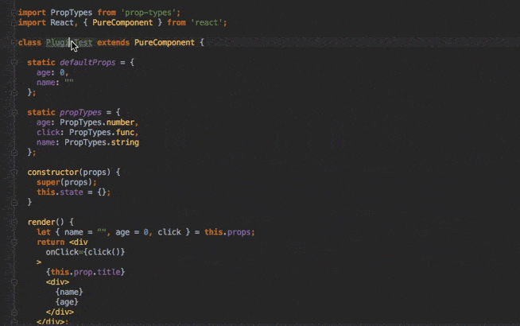
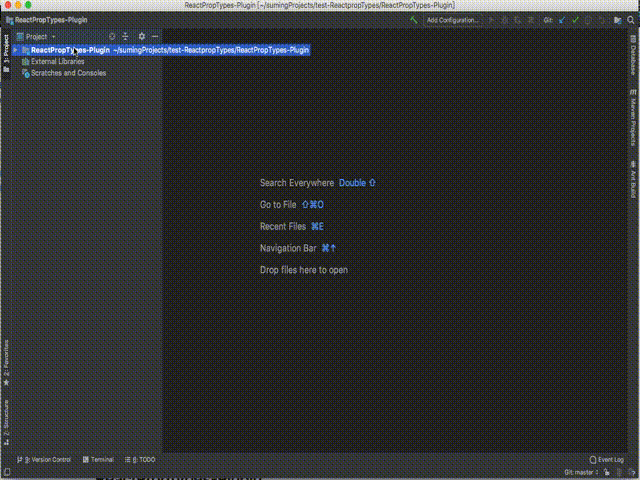

# ReactPropTypes-Plugin
 <a href=https://github.com/dpzxsm/ReactPropTypes-Plugin/blob/master/README_ZH.md>中文文档</a>
 
 This is a JetBrains plug-in that automatically generates PropTypes code for React components, and only supports ES6 later at the moment. Compatible with: IntelliJ IDEA, PhpStorm, WebStorm, PyCharm, RubyMine, AppCode, CLion, Gogland, Rider.
 
 If you are want use it by Visual Code or command line, I suggest you to use another plugin: [react-proptypes-generate](https://github.com/dpzxsm/react-proptypes-generate), now it is imperfect, welcome issue and PR.

## Installed
1. In plugin store search "ReactPropTypes" and install it , this is <a href= https://plugins.jetbrains.com/plugin/10155-reactproptypes>Store Link</a>, Welcome comments.
2. Click <a href=https://raw.githubusercontent.com/dpzxsm/ReactPropTypes-Plugin-Intellij/master/ReactPropTypes.jar>ReactPropTypes.jar</a>(Recently, but may Unstable) to download and open Setting/Plugins/Install Plugin from disk to install.
   
## How to use
1. Select your Component's name
2. Press command + N (Windows is alt + insert) show Generate Group and select PropTypesGenerate, or press shift + command + alt + O (Windows is shift + ctrl + alt + O) in the macOS
3. Edit the PropTypes Table to modify default type

## Preview
#### Class Components

#### Functional Components

#### When you select `Shape` as the PropType

## How to Build and Development the project

#### Dependency Library
* IntelliJ Platform Plugin SDK
* JavaScriptLanguage's lib (In macOS, the path is /Applications/IntelliJ IDEA.app/Contents/plugins/JavaScriptLanguage/lib, Windows are similar)

#### Development Step
1. Download the latest IntelliJ IDEA Ultimate
2. Clone and Open this project
3. Delete default module and import plugin module by `ReactPropTypes.iml`
4. Config Project SDK named IntelliJ IDEA IU-182.** and Config language level 8
5. Config plugin out dir and plugin launch Configurations

#### For Example

## Features
1. Get a heightLight text as component's name if you are not select any text.
1. In the Standard ES6 component, the plugin can distinguish  props's reference and destructuring assignment with keyword "props" or "nextProps".
2. In the Stateless component, only when your first param must be named "props" or a destructuring parameter the plugin can distinguished.
3. If you select ES6 code style , the propTypes code will generate at the last line .Of cause, if you select ES7 code style, the propTypes code will generate at the component inside's first line.
4. Double Click the row's name in the table, can modify distinguished name if not you expect, also support add a new row or delete what you not need.
5. If your component has a default value for props, the plugin will fill the default type to the table.
6. Support PropTypes.shape and handle defaultProps.
7. You can custom your code generate's style.
8. Supports automatic inference of functions and array types in code, and can be opened in the settings.
9. Support full list of PropTypes

## Next plan
1. Developing a similar plugin on the VS Code's platform
2. Support Flow Or TypeScript's TypeChecker, and not use PropTypes