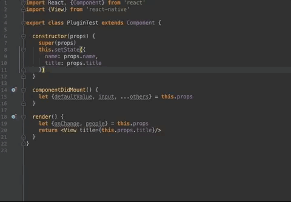

# ReactPropTypes-Plugin
 <a href=https://github.com/dpzxsm/ReactPropTypes-Plugin/blob/master/README_ZH.md>中文文档</a>
 
 This is a JetBrains plug-in that automatically generates PropTypes code for React components, and only supports ES6 later at the moment. If you need to support ES5, please leave a message in issue.Compatible with: IntelliJ IDEA, PhpStorm, WebStorm, PyCharm, RubyMine, AppCode, CLion, Gogland, Rider.

## Installed
1. In plugin store search "ReactPropTypes" and install it , this is <a href= https://plugins.jetbrains.com/plugin/10155-reactproptypes>Store Link</a>, Welcome comments.
2. Click <a href=https://raw.githubusercontent.com/dpzxsm/ReactPropTypes-Plugin-Intellij/master/ReactPropTypes.jar>ReactPropTypes.jar</a>(Recently, but may Unstable) to download and open Setting/Plugins/Install Plugin from disk to install.
   
## How to use
1. Select your Component's name
2. Press command + N (Windows is alt + insert) show Generate Group and select PropTypesGenerate, or press shift + command + alt + P (Windows is shift + ctrl + alt + P) in the macOS
3. Edit the PropTypes Table to modify default type

## Preview

## Features(update to v1.0.7)
1. Get a heightLight text as component's name if you are not select any text.
1. In the Standard ES6 component, the plugin can distinguish  props's reference and destructuring assignment with keyword "props" or "nextProps". 
2. In the Stateless component, only when your first param must be named "props" or a destructuring parameter the plugin can distinguished. 
3. If you select ES6 code style , the propTypes code will generate at the last line .Of cause, if you select ES7 code style, the propTypes code will generate at the component inside's first line.
4. Double Click the row's name in the table, can modify distinguished name if not you expect, also support add a new row or delete what you not need.
5. If your component has a default value for props, the plugin will fill the default type to the table.
6. show the describe about props's source